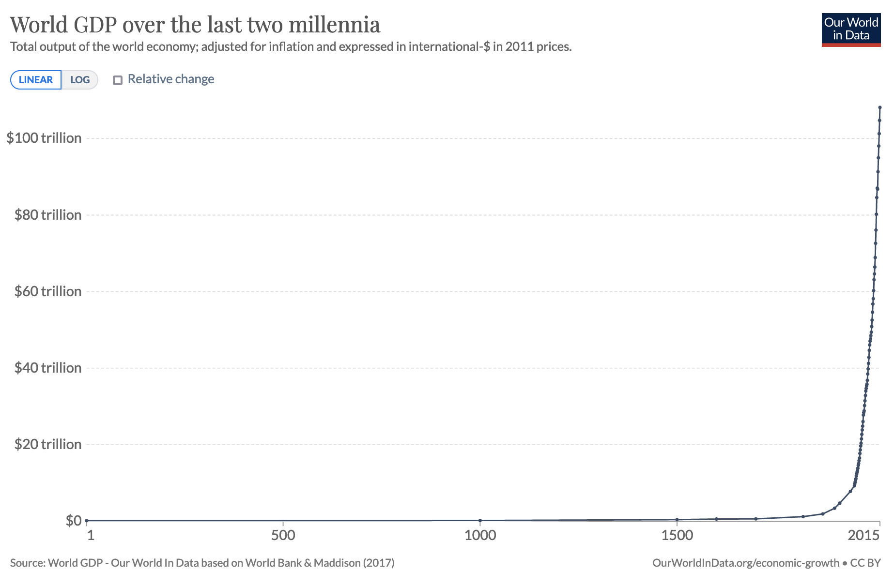

# <span style="color:blue">Human Progress has been ... Lumpy</span>


## <span style="color:darkred">What is Progress?</span>

<!-- According to the Oxford Learner's Dictionary, progress is defined as:

```
1- the process of improving or developing, or of getting nearer to achieving or completing something

2- movement forwards or towards a place
``` -->

Human progress can be understood as a combination of economic, technological, scientific, cultural, and organisational advancement that impacts human lives towards better living standards [[1]](https://www.theatlantic.com/science/archive/2019/07/we-need-new-science-progress/594946/).

Despite of its limitations, GDP has been used as a nearly universal indicator of progress. As shown in the image below, this indicator barely moved until 150-200 years ago.



## <span style="color:darkred">What are the Lumps?</span>

The ancient Greeks were the ingenious people who would think and experiment about everything, including the sphericity of Earth. Romans built on Greek knowledge mastering engineering and warfare and then, 1000 years of regression to a less civilised form of life followed in the West. 

China and the Arabic world came to dominate progress around the year 1100, having superior medicine, literature, architecture and irrigation systems. 

The Renaissance period in Europe with Spain as a dominant military/trade power resulted in the creation of the first global currency: [the silver Spanish Peso](https://www.corporatemonkeycpa.com/2017/09/30/first-global-currency/), which was still used as a monetary reserve until the XVIII century and inspired the creation and symbol of the [US dollar](https://en.wikipedia.org/wiki/Spanish_dollar).

The late 18th and early 19th century saw a boost of progress in England and the U.S., with the beginning of the Industrial Revolution.

## <span style="color:darkred">Progress Studies</span>

It was just the last 200 years that created the conditions for exponential growth and progress in all aspects of life. 

The lumpy nature of progress and the exponentiation in the last 200 years implies that there can be environments that are more efficient at generating progress than others. 

As a species, we do not have a very good understanding on how to re-create the best conditions for progress. 

What do those lumps of progres have in common? Why was Europe so central to progress in the early XX century? Why has it declined now? Can we engineer the conditions to boost progress even further? 

In this blog, I will be sharing information about **Progress Studies** published online. While Collison and Cowen gave this emergent discipline a name [[1]](https://www.theatlantic.com/science/archive/2019/07/we-need-new-science-progress/594946/), I will share information from a wealth of disciplines that look at human progress from a myriad of different angles. 

Let's enjoy unravelling the available knowledge 