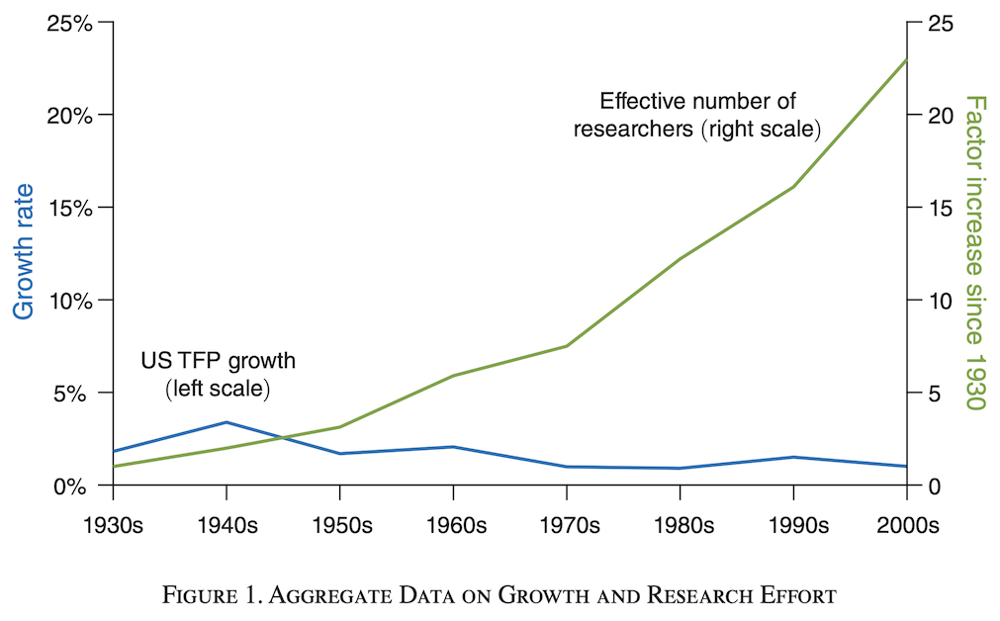
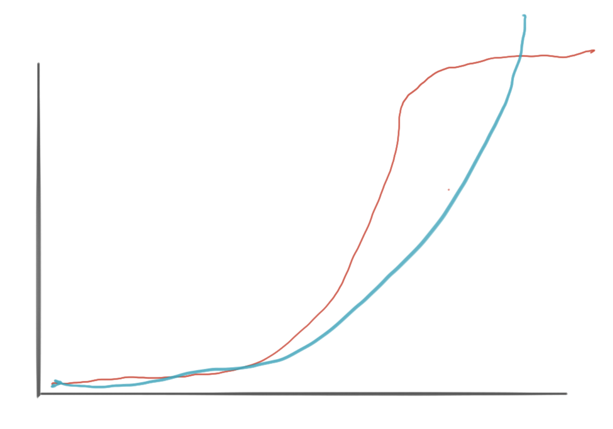

# Is Human Progress Slowing Down?

Before diving on whether progress has stalled or not, I would like with a quick reflection on the value of GDP. How can people in the XXI century survive on less than $1.90 per day? 

People on that income bracket tend to grow their own food and rely on community support. This is something that the West and many formerly communist countries have forgotten. 

From an academic standpoint, looking at how the ratio of input (capital, labour, etc) vs output changes at a micro/macro level makes sense (e.g. profit/GDP). 

## Is Progress Slowing Down?

This [article](https://rootsofprogress.org/can-growth-continue-ignite-talk) shows a few examples that seem to indicate that human progress is slowing down, nearly stalling. 

Bloom et al. recently showed how while the input (number of researchers) of the engine of innovation has not ceased to grow, the output has stalled or even slightly dropped [[1]](https://web.stanford.edu/~chadj/IdeaPF.pdf). 
 

Jason Crawford [[2]](https://rootsofprogress.org/can-growth-continue-ignite-talk) claims that even as ideas are actually getting harder to find, we are also getting better at finding them. He also claims that the greatest threat to long-term economic growth might be the slowdown in population growth:

 

## Can Progress Grow Exponentially?

Paul Romer asked the question whether growth at 7% per year is even possible [[2]](https://paulromer.net/deep_structure_growth/). The answer seems to be that countries starting from low incomes and experiencing huge population growths can sustain this level of growth for decades.

However, our intuition about resource constraints suggests that eventually, growth cannot be sustained.

Paul Romer points at the combinatorial explosion of possibilities as a potential culprit 

There are, however, some other elements that tend to be disregarded:

### 1. Growth is infinite

Many models do not seem to take into account a potential saturation in the capacity of the market to absorb new innovations. It is not a law of diminishing returns, it is simply that incremental innovations defy the laws of physics or biology.

 

### 2. Increments over the same tech 

Increments over the same technology can only deliver fractional improvements that do not really ''compound" for multiplicative gains over time. 

For instance, [[1]](https://web.stanford.edu/~chadj/IdeaPF.pdf) present Moore's Law: our ability to integrate transistors has been getting exponentially better every year, although the basic technology (the transistor) has not changed.

Similar statements can be made of the combustion engine driving the automobile industry. With loads of add ons around it, this tech has remained essentially unchanged. 

Yet again the same is true in medicine, if we factor out our progress in hygene, antibiotics, most advances have been far from dramatic. 

 

These incremental innovations saturate and are best modelled as a sigmoidal function (often the problem is we do now really know where the plateau peak is).

### 3. Revolutionary innovations tend to emerge at moments of crisis

Think of the transistor, DARPA's arpanet (prelude of the Internet), and, more recently, CRISPR and our ability to synthesise vaccines from RNA. 

